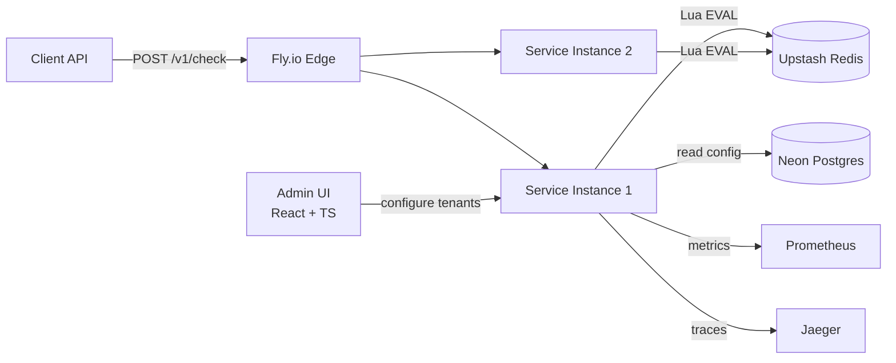

# Distributed Rate Limiter

> Drop-in rate-limiting service supporting token bucket, leaky bucket, and sliding window algorithms. Single API. Atomic Redis ops. Production-ready observability. Terraform-deployed.

[](https://github.com/Utkarsh272/distributed-rate-limiter/actions)
[](https://go.dev)
[](LICENSE)

[Live demo](#) · [Architecture](#architecture) · [Algorithms](#algorithms) · [Benchmarks](#benchmarks) · [Status](#status)

---

## What & Why

Every production backend service eventually needs rate limiting. Most reach for a library, plug it in, and move on. Almost no one understands what's happening under the hood — or why naïve implementations fail under load.

This project is a standalone rate-limiting microservice: an HTTP API that any backend can call to check whether a request should be allowed. It implements three algorithms, keeps all state in Redis via atomic Lua scripts (no race conditions under concurrency), supports per-tenant configuration, and is designed for horizontal scale behind a load balancer.

The engineering story: distributed systems correctness (atomic ops under concurrency), algorithmic trade-offs (why sliding-window-counter beats sliding-window-log at scale), and production practices (IaC, load testing, observability).

---

## Roadmap

> **Status**: 🔲 Planned — starts ~Week 8. See [timeline](#timeline) below.

| # | Milestone | Status |
|---|-----------|--------|
| 1 | Go service skeleton + token bucket (Lua script, atomic) | 🔲 |
| 2 | Leaky bucket + sliding window counter (Lua scripts) | 🔲 |
| 3 | Multi-tenant config: Postgres + in-memory cache + Redis pub/sub invalidation | 🔲 |
| 4 | OpenTelemetry tracing + Prometheus metrics + Grafana dashboard | 🔲 |
| 5 | k6 load test: 0 → 10K RPS ramp, p50/p95/p99 results | 🔲 |
| 6 | Terraform IaC: Fly.io + Upstash Redis + Neon Postgres | 🔲 |
| 7 | GitHub Actions: `terraform plan` on PR, `terraform apply` on main | 🔲 |
| 8 | React + TypeScript admin dashboard: tenant config, live metrics | 🔲 |
| 9 | README, DESIGN.md, demo video | 🔲 |

---

## API

**Hot path — one endpoint, designed to be called on every request:**

```
POST /v1/check
Headers: X-API-Key: <tenant_api_key>
Body:
{
  "key": "user:12345",       // identifier the limit is keyed on
  "action": "api_call",      // looked up against tenant config
  "cost": 1                  // optional, default 1
}

200 OK — allowed:
{
  "allowed": true,
  "limit": 100,
  "remaining": 47,
  "reset_at_unix": 1715200000,
  "retry_after_ms": 0,
  "algorithm": "sliding_window_counter"
}

429 Too Many Requests:
{
  "allowed": false,
  "limit": 100,
  "remaining": 0,
  "reset_at_unix": 1715200060,
  "retry_after_ms": 12500,
  "algorithm": "sliding_window_counter"
}
```

---

## Architecture



### Why Lua scripts in Redis?

The naive `GET → check → SET` pattern has a race condition: two requests can both `GET` the same counter, both see they're under the limit, and both `SET` an incremented value — but only one increment is reflected. Under concurrent load, this allows 2× (or more) the intended traffic through.

Lua scripts run atomically inside Redis. The entire check-and-update is one indivisible operation from Redis's perspective. No race, regardless of how many service instances are hitting the same key.

---

## Algorithms

### Token Bucket
Tokens accumulate at a fixed rate up to a burst capacity. Each request costs N tokens. If the bucket has enough, the request is allowed and tokens are deducted. If not, the caller gets a `retry_after_ms` indicating how long to wait for enough tokens to accumulate.

Best for: APIs that want to allow short bursts while enforcing a sustained average rate.

### Leaky Bucket
Requests enter a virtual queue that drains at a fixed rate. Unlike token bucket, there's no burst allowance — the rate is strictly smoothed. Excess requests are rejected immediately (not queued in the service).

Best for: systems where you want predictable, metered output rather than bursty input.

### Sliding Window Counter
Tracks request counts in two adjacent fixed windows (current + previous), then computes a weighted estimate of requests in the sliding window using linear interpolation. Memory cost: O(1) per key — just two counters. Error bound: ±50% of the window boundary, which is acceptable for most rate-limiting use cases.

This is the default algorithm and the recommended choice for most tenants. It's why `sliding-window-counter` beats `sliding-window-log` (which requires storing every request timestamp, O(N) per key).

---

## Benchmarks

> *These will be filled in at project completion. Targets below are design goals.*

| Metric | Target | Notes |
|--------|--------|-------|
| Sustained RPS | ≥ 8,000 | 2 × Fly.io shared-cpu-1x, Upstash Redis |
| p50 latency | ≤ 2 ms | Lua scripts are cheap |
| p95 latency | ≤ 8 ms | Postgres config misses are rare (30s TTL cache) |
| p99 latency | ≤ 20 ms | Connection pool tail |
| Redis CPU @ peak | < 60% | Headroom for spikes |
| Error rate | < 0.1% | Pool sized correctly |

---

## Config Caching Strategy

Config is read from Postgres once per (tenant, action) pair, cached in-memory with a 30-second TTL, and invalidated across instances via Redis pub/sub. This means:

- Hot path: memory lookup, no DB round trip (< 1 µs)
- Config update propagates to all instances within ~30 seconds via TTL expiry, or instantly if the admin server publishes an invalidation event
- No config DB query on the critical path for warm keys

---

## Observability

Prometheus metrics exported at `/metrics`:

| Metric | Type | Labels |
|--------|------|--------|
| `rate_limit_checks_total` | Counter | tenant, action, result (allowed/denied) |
| `rate_limit_check_duration_ms` | Histogram | tenant, action |
| `redis_eval_duration_ms` | Histogram | script name |
| `config_cache_hits_total` | Counter | hit/miss |

Trace span hierarchy (OpenTelemetry → Jaeger):
```
api.check
├── auth.verify
├── config.get          (cached or db lookup)
│   └── db.query        (only on cache miss)
└── algorithm.execute
    └── redis.eval      (Lua script)
```

---

## Infrastructure as Code

The entire deployment is reproducible with a single `terraform apply`:

```hcl
# Creates: Fly.io app + 2 machines, Upstash Redis cluster, Neon Postgres branch
terraform -chdir=infrastructure apply
```

GitHub Actions pipeline:
- `terraform plan` runs on every PR — diff visible in PR comments
- `terraform apply` runs on merge to `main`

This closes a real gap: most backend engineers have never touched IaC in a personal project. This repo demonstrates end-to-end ownership of infra alongside application code.

---

## Tech Stack

| Layer | Choice | Why |
|-------|--------|-----|
| Service | Go 1.22 + Fiber | Fast, low memory; practice from Mini-Kafka |
| Redis client | `redis/go-redis/v9` | Lua script registry, pipelining |
| Postgres | `jackc/pgx/v5` + pool | Fastest Go Postgres driver |
| Metrics | `prometheus/client_golang` | Standard |
| Tracing | `opentelemetry.io/otel` | Standard |
| Load testing | `grafana/k6` | Scriptable, CI-friendly, free |
| IaC | Terraform + Fly.io / Upstash / Neon providers | Reproducible infra |
| Admin UI | Next.js + TypeScript + shadcn/ui | Another TypeScript surface |

---

## License

MIT
